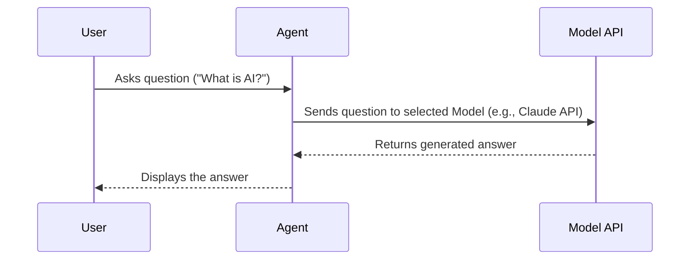

# Chapter 1: Model

Welcome to the Agno examples tutorial! We're going to build some cool AI applications together. But first, let's start with the very core component: the **Model**.

Imagine you want to build an AI assistant, like a chatbot, that can answer your questions. How does this assistant actually "think" and come up with answers? It needs a brain, an engine that provides the intelligence. In the world of AI and Agno, this brain is called the **Model**.

## What's an AI Model?

Think of an AI Model like the engine in a car. Just like cars can have different engines (powerful V8s, efficient electric motors, reliable 4-cylinders), AI assistants can use different Models.

These Models are sophisticated AI systems trained by companies like OpenAI (makers of GPT-4o), Anthropic (makers of Claude), Google (makers of Gemini), and others (like Llama). Each model has its own strengths and weaknesses:

- Some are great at creative writing.
- Others excel at logical reasoning and math.
- Some are faster but maybe less powerful.
- Some are very powerful but might cost more to use.

Examples of popular models include:

- `gpt-4o-mini`, `gpt-4o` (from OpenAI)
- `claude-3-7-sonnet-latest` (from Anthropic)
- `gemini-2.0-flash-exp` (from Google)
- `meta-llama/llama-4-scout-17b-16e-instruct` (from Meta, often accessed via services like Groq)

The **Model** in Agno represents this underlying AI engine. It's the core component that understands language, processes information, and generates responses for your AI applications.

## Why Different Models?

You might want to choose different models for different tasks. For example:

- An [Agent](02_agent_.md) designed to write poetry might use a highly creative model like Claude Sonnet.
- An [Agent](02_agent_.md) designed to analyze financial data might use a model known for strong reasoning like GPT-4o.
- A simple chatbot might use a faster, cheaper model like `gpt-4o-mini`.

Agno makes it super easy to specify which model an [Agent](02_agent_.md) or a [Team](08_team_.md) should use, and even swap them out later if you change your mind!

## Using Models in Agno

In Agno, you typically don't use the `Model` directly. Instead, you assign a `Model` when you create an [Agent](02_agent_.md) or a [Team](08_team_.md). The `Agent` then uses its assigned `Model` to perform tasks.

Let's look at a very simple example.

```python
# File: agents/basic_agent.py
# Import the Agent class and the specific Model we want
from agno.agent import Agent
from agno.models.anthropic import Claude

# Create an Agent and tell it which Model to use
agent = Agent(
    model=Claude(id="claude-3-7-sonnet-latest"), # <-- Specify the Model here
    markdown=True
)

# Ask the agent a question. It will use its Model to answer.
agent.print_response("What is the capital of France?", stream=True)
```

**Explanation:**

1.  We import the `Agent` class and the `Claude` model class from Agno's model providers (`agno.models.anthropic`).
2.  When we create the `Agent`, we pass `model=Claude(id="claude-3-7-sonnet-latest")` to its constructor. This tells the agent to use Anthropic's Claude Sonnet model as its "brain".
3.  The `id` specifies the exact version of the Claude model we want to use.
4.  When `agent.print_response(...)` is called, the Agent sends the question "What is the capital of France?" to the Claude model, gets the answer, and prints it.

What if we wanted to use OpenAI's GPT-4o mini instead? It's just as easy!

```python
# File: adapted from agents/agent_team.py
# Import the Agent class and the specific Model we want
from agno.agent import Agent
from agno.models.openai import OpenAIChat # <-- Different model import

# Create an Agent using a different Model
web_agent = Agent(
    name="Web Search Agent",
    role="Handle web search requests",
    model=OpenAIChat(id="gpt-4o-mini"), # <-- Specify the OpenAI Model here
    # ... other parameters ...
)

# Ask the agent a question. It uses GPT-4o mini now.
# web_agent.print_response("What is the capital of Canada?")
```

**Explanation:**

Notice how similar this is! We just changed the import to `OpenAIChat` from `agno.models.openai` and set `model=OpenAIChat(id="gpt-4o-mini")`. Agno handles the details of talking to the different model providers behind the scenes.

You can see this flexibility in the `agents/agent_team.py` example, where different agents in a team use different models:

```python
# File: agents/agent_team.py (Simplified)
# ... imports ...
from agno.models.anthropic import Claude
from agno.models.openai import OpenAIChat

# Web Agent uses OpenAI
web_agent = Agent(
    # ... other details ...
    model=OpenAIChat(id="gpt-4o-mini"),
    # ... other details ...
)

# Finance Agent also uses OpenAI
finance_agent = Agent(
    # ... other details ...
    model=OpenAIChat(id="gpt-4o-mini"),
    # ... other details ...
)

# The Team Leader uses Anthropic's Claude
team_leader = Team(
    # ... other details ...
    model=Claude(id="claude-3-7-sonnet-latest"),
    members=[web_agent, finance_agent],
    # ... other details ...
)
```

This allows you to optimize your application by choosing the best "engine" for each specific job.

## Under the Hood: How it Works

When you ask an [Agent](02_agent_.md) to do something (like answer a question), here's a simplified view of what happens:

1.  **You:** Give a task to the Agent (e.g., `agent.print_response("Hello!")`).
2.  **Agent:** Takes your task and prepares it for its assigned `Model`.
3.  **Agent -> Model:** Sends the prepared task to the specific AI Model (e.g., Claude Sonnet via Anthropic's API, or GPT-4o via OpenAI's API).
4.  **Model:** Processes the task (thinks!) and generates a response.
5.  **Model -> Agent:** Sends the generated response back to the Agent.
6.  **Agent:** Receives the response, might do some final formatting, and then presents it (e.g., prints it to your screen).

Here's a diagram showing the flow:



Agno's `Model` classes (`OpenAIChat`, `Claude`, `Gemini`, etc.) handle the complex details of communicating with the different AI service providers' APIs, so you don't have to worry about them. You just pick the model you want!

## Conclusion

You've learned about the **Model**, the fundamental AI engine that powers Agents and Teams in Agno. It's the source of intelligence, understanding, and generation capabilities. Key takeaways:

- A `Model` is like the "brain" or "engine" of an AI Agent.
- Different models (GPT-4o, Claude, Gemini) have different strengths.
- Agno makes it easy to choose and switch between models from various providers (OpenAI, Anthropic, Google, etc.).
- You assign a `Model` when creating an [Agent](02_agent_.md) using the `model=` parameter.

Now that we understand the engine, let's learn more about the vehicle it powers! In the next chapter, we'll dive into the concept of the [Agent](02_agent_.md) itself.

**[Next Chapter: Agent](02_agent_.md)**

---

Generated by [AI Codebase Knowledge Builder](https://github.com/The-Pocket/Tutorial-Codebase-Knowledge)
