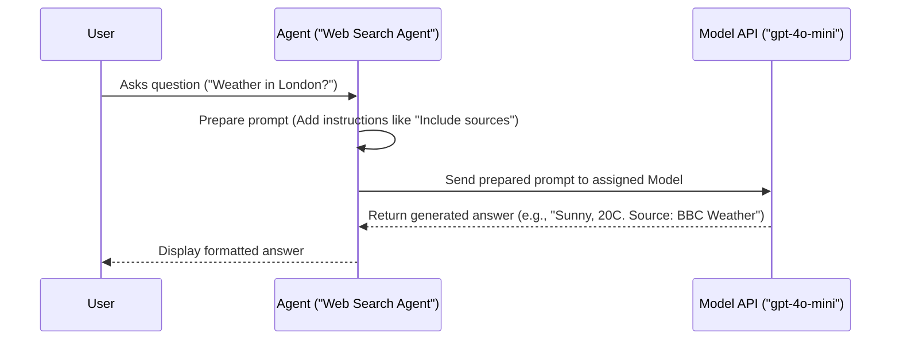

# Chapter 2: Agent

Welcome back! In the [previous chapter](01_model_html), we learned about the **[Model](01_model_html)** – the AI "brain" or "engine" that provides the core intelligence for our applications. We saw how different models (like GPT-4o or Claude) offer various capabilities.

Now, let's talk about the **Agent**, the star player in the Agno framework!

## What is an Agent?

If the [Model](01_model_html) is the engine, think of the **Agent** as the specialized vehicle built around that engine. It's the core building block you'll use most often in Agno.

Imagine you're building a company. You wouldn't hire just one person with a general "brain" to do everything, right? You'd hire specialists: a customer support representative, a researcher, a financial analyst, a creative writer, etc. Each specialist has the same basic ability to think (like our AI [Model](01_model_html)), but they are trained and equipped for a _specific role or task_.

An **Agent** in Agno is exactly like that: a specialized AI assistant designed for a particular job.

- It has a **brain** (the [Model](01_model_html) we choose for it).
- It can follow specific **instructions** (like a job description).
- It can use **[Tools](03_tools_.html)** (like a researcher using a search engine or a financial analyst using a calculator).
- It works towards accomplishing **goals** based on its role and the task you give it.

Just like hiring different specialists, you create different Agents in Agno tailored to specific needs.

## Why Use Agents?

Using Agents allows you to break down complex problems into smaller, manageable parts. Instead of one giant AI trying to do everything, you can have:

- A `WebSearchAgent` that's really good at finding information online.
- A `FinanceAgent` that knows how to get stock prices.
- A `CustomerSupportAgent` that's polite and knows your product documentation.

This makes your AI applications more organized, capable, and easier to manage.

## Creating Your First Agent

Let's build a very simple Agent. Its role will be just to answer a basic question. We'll use the `basic_agent.py` example as a base.

```python
# File: agents/basic_agent.py (Simplified for tutorial)

# 1. Import the Agent class and the Model we want
from agno.agent import Agent
from agno.models.anthropic import Claude

# 2. Create the Agent instance
#    - We give it a "brain" using the 'model' parameter.
#    - We tell it to format its output nicely using 'markdown=True'.
basic_assistant = Agent(
    model=Claude(id="claude-3-7-sonnet-latest"), # The AI engine
    markdown=True                         # Format output nicely
)

# 3. Give the Agent a task (ask it a question)
#    - The Agent uses its Model to figure out the answer.
print("Asking the basic assistant a question...")
basic_assistant.print_response("What is the capital of France?", stream=True)

# Expected Output (something like):
# Asking the basic assistant a question...
# The capital of France is Paris.
```

**Explanation:**

1.  **Import:** We import the `Agent` class itself and the `Claude` [Model](01_model_html) class (from Anthropic).
2.  **Create:** We create an instance of the `Agent`. The most important part here is `model=Claude(...)`, where we assign its "brain". We're telling it to use Anthropic's Claude Sonnet model. `markdown=True` just makes the output look better in the terminal.
3.  **Run:** We call the `print_response` method on our `basic_assistant`. We give it the question "What is the capital of France?". The Agent takes this question, sends it to its assigned Claude model, gets the answer back ("Paris"), and prints it nicely.

## Giving Agents Instructions

Agents become much more powerful when you give them specific instructions, like a job description. Let's make an Agent that fetches stock prices and _always_ presents the data in a table, with no extra chat. We'll adapt `agent_with_instructions.py`.

```python
# File: agent_with_instructions.py (Simplified for tutorial)

from agno.agent import Agent
from agno.models.anthropic import Claude
# We'll learn about Tools later, just know this lets it get stock prices
from agno.tools.yfinance import YFinanceTools

# 1. Define instructions for the Agent
instructions = [
    "Use tables to display data.",
    "Only include the table in your response. No other text.",
]

# 2. Create the Agent with instructions
#    - It uses the Claude model again.
#    - It has a Tool to get stock prices (more in the next chapter!).
#    - Crucially, we pass our 'instructions' list.
stock_reporter = Agent(
    model=Claude(id="claude-3-7-sonnet-latest"),
    tools=[YFinanceTools(stock_price=True)], # Tool to get stock data
    instructions=instructions,              # Specific instructions!
    markdown=True
)

# 3. Ask for a stock price
print("Asking the stock reporter for Apple's price...")
stock_reporter.print_response("What is the stock price of Apple?", stream=True)

# Expected Output (something like a Markdown table):
# Asking the stock reporter for Apple's price...
# | Ticker | Price    | Currency   |
# | :----- | :------- | :--------- |
# | AAPL   | 214.29   | USD        |
```

**Explanation:**

1.  **Instructions:** We create a list of strings, telling the Agent exactly how we want it to behave.
2.  **Create:** When creating the `stock_reporter` Agent, we pass this list using the `instructions=` parameter. We also give it a [Tool](03_tools_.html) (`YFinanceTools`) so it can actually _get_ the stock price (don't worry too much about this yet, [Tools](03_tools_.html) are next!).
3.  **Run:** When we ask for Apple's stock price, the Agent follows its instructions. It gets the price using its tool, and then formats the answer _only_ as a Markdown table, exactly as instructed.

This shows how instructions allow you to customize an Agent's behavior for its specific role.

## Roles and Names

You can also give Agents descriptive names and roles, which helps when organizing them, especially in [Teams](08_team_.html).

```python
# File: adapted from agents/agent_team.py

from agno.agent import Agent
from agno.models.openai import OpenAIChat
from agno.tools.duckduckgo import DuckDuckGoTools # A web search tool

web_agent = Agent(
    name="Web Search Agent",             # Give the agent a clear name
    role="Handle web search requests",  # Define its specific job
    model=OpenAIChat(id="gpt-4o-mini"),  # Use a different model
    tools=[DuckDuckGoTools()],           # Give it a web search tool
    instructions="Always include sources.", # Specific instruction
    # ... other parameters ...
)

# Now you can refer to `web_agent` knowing its specific purpose.
# web_agent.print_response("What's the weather in London?")
```

Giving clear names and roles makes your code easier to understand and helps the Agents (especially within a [Team](08_team_.html)) know their responsibilities.

## Under the Hood: How Agents Work

When you give an Agent a task (like `agent.print_response("Hello!")`), what actually happens?

1.  **You -> Agent:** You call a method like `print_response` with your input ("Hello!").
2.  **Agent Prepares:** The Agent takes your input. It looks at its configuration: its `instructions`, its `role`, maybe its [Memory](06_memory_.html) or [Knowledge](05_knowledge_.html) (we'll cover these later!). It prepares a prompt to send to its [Model](01_model_html). This prompt includes your input, its instructions, and potentially other context.
3.  **Agent -> Model:** The Agent sends this carefully prepared prompt to the specific AI [Model](01_model_html) it was assigned (e.g., `Claude`, `OpenAIChat`). This usually involves making an API call to the model provider (like Anthropic or OpenAI).
4.  **Model Thinks:** The AI [Model](01_model_html) processes the prompt and generates a response based on its training and the instructions it received.
5.  **Model -> Agent:** The [Model](01_model_html) sends the generated response back to the Agent.
6.  **Agent Presents:** The Agent receives the response. It might do some final processing (like ensuring it's formatted as Markdown if `markdown=True`). Then, it delivers the result (e.g., `print_response` prints it to the console).

Here's a simplified diagram:



The `Agent` class in Agno orchestrates this entire process, making it easy for you to leverage the power of the underlying [Model](01_model_html) with added structure, instructions, and capabilities like using [Tools](03_tools_.html).

## Conclusion

You've now met the **Agent**, the fundamental building block for creating specialized AI assistants in Agno.

Key Takeaways:

- An Agent is like a specialized AI worker designed for a specific role (e.g., researcher, writer, analyst).
- It uses a [Model](01_model_html) as its "brain".
- You guide its behavior using `instructions`.
- Agents can be given `name`s and `role`s for clarity.
- They form the core of most Agno applications.

Agents are powerful on their own, but they become truly superhuman when they can use **Tools** to interact with the outside world or perform complex calculations. Let's dive into that next!

**[Next Chapter: Tools](03_tools_.html)**

---
