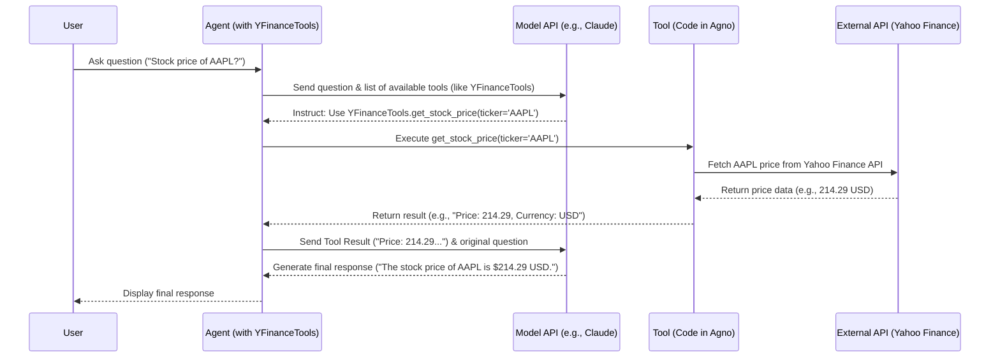

# Chapter 3: Tools

In the [previous chapter](02_agent_.md), we met the **[Agent](02_agent_.md)**, our specialized AI assistant built around a powerful **[Model](01_model_.md)**. We learned how to give Agents instructions to guide their behavior.

But what if our Agent needs information that wasn't in its training data? What if it needs to know the _current_ stock price of Apple, search the web for today's news, or perform a complex calculation? By default, an [Agent](02_agent_.md)'s knowledge is frozen at the time its [Model](01_model_.md) was trained. It can't access real-time information or perform actions outside of generating text.

This is where **Tools** come in!

## What are Tools?

Imagine you hire a very smart assistant ([Agent](02_agent_.md)) with a great brain ([Model](01_model_.md)). They can write, analyze, and talk about many things based on their general knowledge. But if you ask them for the current weather, the result of a complex calculation, or information from a specific database, they'll need some equipment to find the answer.

**Tools** in Agno are like that specialized equipment. They give your Agents the ability to:

- **Interact with the outside world:** Search the web (using DuckDuckGo, Exa, Google), get financial data (YFinance), fetch data from databases (SQL), connect to other software (MCP, E2B).
- **Perform specific actions:** Use a calculator, execute code.

By equipping an [Agent](02_agent_.md) with Tools, you empower it to go beyond its pre-trained knowledge and perform tasks that require real-time data, calculations, or interactions with other systems.

Think of them as superpowers for your Agents!

Some common tools you might use in Agno include:

- `DuckDuckGoTools`: For searching the web.
- `YFinanceTools`: For getting stock prices and financial data.
- `CalculatorTools`: For performing math calculations.
- `SQLTools`: For querying databases.
- `ReasoningTools`: Helps the agent think step-by-step (more on this in the [next chapter](04_reasoning___thinking_tools_.md)!).
- `MCPTools`, `E2BTools`: For interacting with other software platforms.

## Giving Your Agent a Tool

Let's give our Agent the ability to fetch current stock prices. We'll use the `YFinanceTools` for this. We'll adapt the `agent_with_tools.py` example.

```python
# File: agents/agent_with_tools.py (Simplified for tutorial)

# 1. Import Agent, Model, and the specific Tool
from agno.agent import Agent
from agno.models.anthropic import Claude
from agno.tools.yfinance import YFinanceTools # <-- Import the Tool

# 2. Create the Agent
basic_analyst = Agent(
    model=Claude(id="claude-3-7-sonnet-latest"), # The AI engine
    # 3. Give the Agent the Tool!
    tools=[YFinanceTools(stock_price=True)], # <-- Add the Tool here
    markdown=True
)

# 4. Ask a question that requires the Tool
print("Asking the basic analyst for Apple's stock price...")
basic_analyst.print_response("What is the stock price of Apple?", stream=True)

# Expected Output (will vary based on the current stock price):
# Asking the basic analyst for Apple's stock price...
# The current stock price for Apple (AAPL) is $214.29 USD.
```

**Explanation:**

1.  **Import:** We import `Agent`, `Claude` (our [Model](01_model_.md)), and crucially, `YFinanceTools` from `agno.tools.yfinance`.
2.  **Create Agent:** We initialize our `Agent` as usual, assigning it the `Claude` model.
3.  **Add Tool:** This is the key step! We pass a list to the `tools=` parameter. Inside the list, we create an instance of `YFinanceTools(stock_price=True)`. This tells the Agent, "You now have a Yahoo Finance tool available, specifically configured to get stock prices."
4.  **Run:** We ask the Agent a question ("What is the stock price of Apple?"). The Agent, guided by its [Model](01_model_.md), realizes it needs external, real-time data. It sees it has the `YFinanceTools` available. It uses the tool to fetch the current price from Yahoo Finance and then incorporates that information into its final answer.

Without the `tools=[YFinanceTools(...)]` line, the Agent would likely respond that it doesn't have real-time access to stock prices or give an outdated price from its training data.

## Multiple Tools

Agents aren't limited to just one tool! You can give them a whole toolbox. Look at the `finance_agent` in the `agents/agent_team.py` example:

```python
# File: agents/agent_team.py (Snippet)
# ... imports ...
from agno.tools.yfinance import YFinanceTools

finance_agent = Agent(
    name="Finance Agent",
    role="Handle financial data requests",
    model=OpenAIChat(id="gpt-4o-mini"),
    # Give the agent multiple YFinance capabilities
    tools=[
        YFinanceTools(
            stock_price=True,               # Can get stock price
            analyst_recommendations=True,   # Can get analyst ratings
            company_info=True               # Can get company details
        )
    ],
    instructions="Use tables to display data.",
    # ... other parameters ...
)

# Now this agent can answer questions like:
# - "What's the stock price of MSFT?"
# - "Show me analyst recommendations for GOOG."
# - "Give me company info for AMZN."
```

Here, the `finance_agent` is equipped with a `YFinanceTools` instance configured to fetch stock prices, analyst recommendations, _and_ company info. The [Agent](02_agent_.md) will automatically figure out which part of the tool to use based on the question asked.

You can also give an Agent multiple _different_ tools:

```python
# File: adapted from agents/agent_with_reasoning.py

from agno.agent import Agent
from agno.models.anthropic import Claude
from agno.tools.reasoning import ReasoningTools # <-- Tool 1
from agno.tools.yfinance import YFinanceTools   # <-- Tool 2

reasoning_analyst = Agent(
    model=Claude(id="claude-3-7-sonnet-latest"),
    tools=[
        ReasoningTools(add_instructions=True), # Add Reasoning Tool
        YFinanceTools(                         # Add YFinance Tool
            stock_price=True,
            analyst_recommendations=True,
            company_info=True,
            company_news=True,
        ),
    ],
    # ... other parameters ...
)

# This agent can now use YFinance to get data AND use ReasoningTools
# to think step-by-step about how to structure a report.
# reasoning_analyst.print_response("Write a report on NVDA")
```

This `reasoning_analyst` has both `ReasoningTools` (to help it plan and think) and `YFinanceTools` (to get financial data). When asked to write a report, it can use both tools together to accomplish the task.

## Under the Hood: How Agents Use Tools

When you give an Agent a task that might require a tool, here's a simplified flow of what happens:

1.  **You -> Agent:** You provide input (e.g., "What's the stock price of AAPL?").
2.  **Agent -> Model:** The Agent sends your request, its instructions, and a list of its available `tools` (like `YFinanceTools` with its capabilities) to its assigned [Model](01_model_.md) (e.g., Claude).
3.  **Model Decides:** The [Model](01_model_.md) analyzes the request and the available tools. It decides if a tool is needed and, if so, which one and how to call it (e.g., "Call `YFinanceTools.get_stock_price` with the ticker `AAPL`").
4.  **Model -> Agent:** The [Model](01_model_.md) tells the Agent which tool function to execute and what arguments to use.
5.  **Agent -> Tool:** The Agent executes the specific function on the Tool instance (e.g., calls the `get_stock_price` method within the `YFinanceTools` object).
6.  **Tool -> External Service:** The Tool's code runs. In this case, it makes an API call to Yahoo Finance to get Apple's stock price.
7.  **External Service -> Tool:** Yahoo Finance sends back the stock price data.
8.  **Tool -> Agent:** The Tool processes the data and returns the result (e.g., price, currency) to the Agent.
9.  **Agent -> Model (Again):** The Agent sends the result obtained from the tool back to the [Model](01_model_.md), along with the original question, asking it to formulate the final answer.
10. **Model -> Agent:** The [Model](01_model_.md) generates the final, human-readable response incorporating the tool's result (e.g., "The current stock price for Apple (AAPL) is $214.29 USD.").
11. **Agent -> You:** The Agent presents the final answer.

Here's that flow visualized:



Agno handles the complex parts of this process: letting the [Model](01_model_.md) know which tools are available, executing the chosen tool function, and feeding the results back into the conversation. You just need to provide the tools!

## Conclusion

You've learned how **Tools** give your Agno **[Agents](02_agent_.md)** superpowers! They allow Agents to break free from the limitations of their training data and interact with the real world.

Key Takeaways:

- Tools enable Agents to perform actions like searching the web, fetching real-time data, doing calculations, or running code.
- You equip an [Agent](02_agent_.md) with tools by passing a list of tool instances to the `tools=` parameter during initialization.
- Agents can use multiple tools, and the underlying [Model](01_model_.md) intelligently decides which tool to use based on the task.
- Tools make Agents vastly more capable and useful for practical applications.

While tools like web search and calculators are powerful, sometimes Agents need help _thinking_ through complex problems step-by-step. That's where a special kind of tool comes in. Let's explore that next!

**[Next Chapter: Reasoning / Thinking Tools](04_reasoning___thinking_tools_.md)**

---

Generated by [AI Codebase Knowledge Builder](https://github.com/The-Pocket/Tutorial-Codebase-Knowledge)
