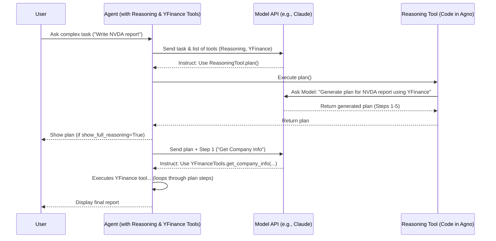

# Chapter 4: Reasoning / Thinking Tools

Welcome back! In the [previous chapter](03_tools_.md), we learned how standard **[Tools](03_tools_.md)** give our **[Agents](02_agent_.md)** superpowers to interact with the outside world, like searching the web or getting stock prices.

But what happens when an [Agent](02_agent_.md) needs to tackle a really complex task? Something that requires planning, breaking down steps, or thinking through different options before giving a final answer?

Imagine asking an assistant to "Write a comprehensive report comparing NVIDIA and AMD, including their latest financial performance, product lines, and future outlook." A simple [Agent](02_agent_.md) might just try to answer directly, potentially missing key steps or structure. Wouldn't it be better if the assistant could first *plan* its approach?

This is where **Reasoning / Thinking Tools** come in!

## What are Reasoning / Thinking Tools?

Think of Reasoning/Thinking tools as giving your [Agent](02_agent_.md) the ability to **"think out loud"** or **"create a draft plan"** before committing to a final action or response.

It's a specialized type of [Tool](03_tools_.md) that doesn't necessarily interact with the *outside* world, but rather helps the [Agent](02_agent_.md) structure its *internal* thought process.

Using these tools, an [Agent](02_agent_.md) can:

*   **Break down** a complex task into smaller, manageable steps.
*   **Evaluate** different potential approaches or strategies.
*   **Self-correct** if its initial plan seems flawed.
*   **Analyze** information more deeply before synthesizing a response.

This leads to more robust, well-thought-out, and reliable outputs, especially for tasks that aren't straightforward. It's like watching someone sketch out an outline before writing an essay – the final result is usually much better organized.

Agno provides tools like `ReasoningTools` and `ThinkingTools` specifically for this purpose.

## Giving Your Agent the Power to Think

Let's equip an [Agent](02_agent_.md) with the ability to reason. We'll adapt the `reasoning_finance_agent.py` example. Our agent needs to write a report on NVIDIA (NVDA), which involves multiple steps (getting info, news, recommendations, then structuring the report).

```python
# File: agents/reasoning_finance_agent.py (Simplified for tutorial)

from agno.agent import Agent
from agno.models.anthropic import Claude
from agno.tools.reasoning import ReasoningTools # <-- Import the Reasoning Tool
from agno.tools.yfinance import YFinanceTools   # <-- Import regular Tools

# 1. Create the Agent
report_writer_agent = Agent(
    model=Claude(id="claude-3-7-sonnet-latest"),
    # 2. Add ReasoningTools alongside other tools
    tools=[
        ReasoningTools(add_instructions=True), # <-- Add the power to think!
        YFinanceTools(                         # <-- Regular tool for data
            stock_price=True,
            analyst_recommendations=True,
            company_info=True,
            company_news=True,
        ),
    ],
    instructions=[
        "Use tables to display data.",
        "Include sources in your response.",
        "Only include the report in your response. No other text.",
    ],
    markdown=True,
)

# 3. Ask for the complex report
print("Asking the agent to write a report on NVDA...")
report_writer_agent.print_response(
    "Write a report on NVDA",
    stream=True,
    show_full_reasoning=True, # <-- Ask to see the thinking process
    stream_intermediate_steps=True # <-- Show steps as they happen
)

# Expected Output (Conceptual):
# Asking the agent to write a report on NVDA...
#
# == Reasoning Step 1: Plan ==
# The user wants a report on NVDA. I need to:
# 1. Get company info for NVDA using YFinanceTools.
# 2. Get the latest stock price for NVDA using YFinanceTools.
# 3. Get analyst recommendations for NVDA using YFinanceTools.
# 4. Get recent company news for NVDA using YFinanceTools.
# 5. Synthesize this information into a structured report following instructions.
#
# == Executing Step 1: Get Company Info ==
# (Agent calls YFinanceTools.get_company_info...)
# (Tool returns info...)
#
# == Executing Step 2: Get Stock Price ==
# (Agent calls YFinanceTools.get_stock_price...)
# (Tool returns price...)
#
# ... (Agent continues executing plan using tools) ...
#
# == Reasoning Step X: Final Check ==
# I have gathered all the information. Now I will format it into a report as requested.
#
# == Final Report ==
#
# ## NVIDIA (NVDA) Report
#
# ### Company Information
# | Ticker | Name   | Sector      | ... |
# | :----- | :----- | :---------- | :-: |
# | NVDA   | NVIDIA | Technology  | ... |
#
# ### Stock Price
# | Ticker | Price | Currency | ... |
# | :----- | :---- | :------- | :-: |
# | NVDA   | ...   | USD      | ... |
#
# ... (Rest of the report including news, recommendations etc.) ...
```

**Explanation:**

1.  **Import:** We import `ReasoningTools` along with the other necessary classes.
2.  **Add Tool:** Just like any other [Tool](03_tools_.md), we add an instance of `ReasoningTools()` to the `tools=` list when creating the `Agent`. The `add_instructions=True` helps guide the [Model](01_model_.md) on how to use the tool effectively.
3.  **Run with Reasoning Visible:** When we call `print_response`, we add two crucial arguments:
    *   `show_full_reasoning=True`: This tells Agno we want to see the output generated by the `ReasoningTools`.
    *   `stream_intermediate_steps=True`: This shows us the agent's actions (like calling other tools) as they happen, often guided by the reasoning plan.
4.  **Output:** Notice how the conceptual output includes "Reasoning Step" blocks. This is the agent "thinking out loud" – planning its actions before executing them. It breaks down the task, uses its other tools (`YFinanceTools`) systematically, and then compiles the final report.

Without `ReasoningTools`, the agent might try to do everything at once and produce a less structured or incomplete report.

*Note:* Different examples might use `ThinkingTools` instead of `ReasoningTools` (like `thinking_finance_agent.py`). They serve a very similar purpose – helping the agent structure its thoughts.

## Under the Hood: How Reasoning Works

How does adding `ReasoningTools` or `ThinkingTools` actually make the [Agent](02_agent_.md) "think"?

1.  **You -> Agent:** You give the Agent a complex task (e.g., "Write a report on NVDA").
2.  **Agent -> Model:** The Agent sends your request, its instructions, and the list of available tools (including `ReasoningTools` and `YFinanceTools`) to its [Model](01_model_.md) (e.g., Claude).
3.  **Model Decides to Plan:** The [Model](01_model_.md), recognizing the complexity and the availability of `ReasoningTools`, decides that planning is the best first step. It decides to call the `ReasoningTools` (often a specific function within it like `think` or `plan`).
4.  **Model -> Agent (Instruction to Think):** The Model tells the Agent: "Use `ReasoningTools` to create a plan for this task."
5.  **Agent -> Reasoning Tool:** The Agent executes the `ReasoningTools` function.
6.  **Reasoning Tool -> Model (Prompt to Generate Plan):** The `ReasoningTools` code essentially asks the *same* [Model](01_model_.md) (or sometimes a specialized reasoning model): "Given the user's request ('Write a report on NVDA') and the available tools (YFinance), create a step-by-step plan."
7.  **Model -> Reasoning Tool (Generated Plan):** The Model generates the plan (like the steps listed in the conceptual output above).
8.  **Reasoning Tool -> Agent (Plan):** The Tool returns the generated plan to the Agent.
9.  **Agent -> You (Show Plan - Optional):** If `show_full_reasoning=True`, the Agent displays this plan.
10. **Agent -> Model (Execute Plan):** The Agent, now equipped with the plan, proceeds to execute the steps. It sends the plan and the next step back to the [Model](01_model_.md), asking it to decide which *other* tool (like `YFinanceTools`) to call for the current step.
11. **(Model -> Agent -> Tool -> ... -> Agent -> Model):** The Agent executes the steps in the plan, potentially calling other tools as needed (like we saw in the [Tools chapter](03_tools_.md)). It might even use the Reasoning Tool again to reflect or adjust the plan mid-way.
12. **Agent -> You (Final Answer):** Once all steps are completed according to the plan, the Agent presents the final result.

Here's a simplified flow diagram:



The key idea is that the `ReasoningTools` facilitate a conversation *between the Agent and its own Model* to structure the problem-solving process *before* or *during* the execution phase. Agno manages this internal dialogue, making complex reasoning accessible by simply adding the tool.

## Conclusion

You've now learned about **Reasoning / Thinking Tools**, a powerful way to enhance your Agno **[Agents](02_agent_.md)**.

Key Takeaways:

*   Reasoning/Thinking tools help Agents plan, break down complex tasks, and think step-by-step.
*   They act like an internal "scratchpad" or "drafting" process for the [Agent](02_agent_.md).
*   You add them like any other [Tool](03_tools_.md) (e.g., `tools=[ReasoningTools(), ...]`).
*   Using parameters like `show_full_reasoning=True` lets you observe the Agent's thought process.
*   This leads to more reliable and well-structured outputs for complex requests.

So far, our Agents have a brain ([Model](01_model_.md)), a purpose ([Agent](02_agent_.md)), tools to act ([Tools](03_tools_.md)), and even tools to think ([Reasoning Tools](04_reasoning___thinking_tools_.md)). But what if we want to give them specific documents or data to learn from? That's where **Knowledge** comes in, and we'll explore it next!

**[Next Chapter: Knowledge](05_knowledge_.md)**

---

Generated by [AI Codebase Knowledge Builder](https://github.com/The-Pocket/Tutorial-Codebase-Knowledge)