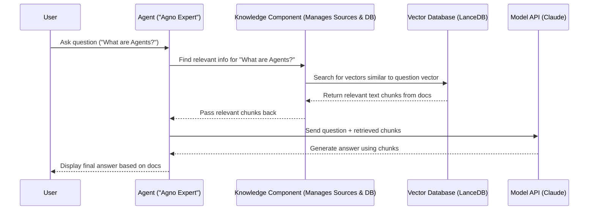

# Chapter 5: Knowledge

In the [previous chapter](04_reasoning___thinking_tools_.md), we saw how **[Reasoning / Thinking Tools](04_reasoning___thinking_tools_.md)** help **[Agents](02_agent_.md)** plan and think through complex tasks step-by-step. They improve the _process_ of getting an answer.

But what about the information itself? An [Agent](02_agent_.md)'s [Model](01_model_.md) (like GPT-4o or Claude) knows a lot from its training, but that knowledge is:

1.  **Frozen in time:** It doesn't know about events or information created _after_ it was trained.
2.  **General:** It might not know the specific details of _your_ company's internal documents, a particular PDF manual, or the latest content on a specific website.

Imagine asking your AI assistant about the features of a brand new product described in a PDF document it's never seen. It won't know the answer!

This is where **Knowledge** comes in. It's like giving your [Agent](02_agent_.md) access to a specific, curated library or database _in addition_ to its general knowledge.

## What is Knowledge?

Think of the standard [Agent](02_agent_.md) as a smart person who has read a vast encyclopedia (their training data). The **Knowledge** feature is like handing that person a specific folder of documents, a technical manual, or access to a particular website and saying, "You can also look things up in _here_ when you need to answer questions."

Specifically, Knowledge allows an [Agent](02_agent_.md) to:

- Access information from external sources like PDFs, websites, text files, or even databases.
- Answer questions based on up-to-date or specialized documents that weren't part of its original training.
- Provide answers grounded in specific source material.

This process is often called **Retrieval-Augmented Generation (RAG)**. It means the [Agent](02_agent_.md) first **Retrieves** relevant information from the knowledge source you gave it, and then **Augments** its response generation using that retrieved information.

## How Does Knowledge Work? (The RAG Idea)

So, how does an [Agent](02_agent_.md) efficiently search through potentially large documents like PDFs or websites? It uses a clever system:

1.  **Indexing the Knowledge:** When you provide documents (like PDFs or website URLs) to the Knowledge component, Agno processes them.

    - It breaks the documents down into smaller chunks (paragraphs or sentences).
    - It uses a special type of [Model](01_model_.md) called an **Embedder** (like `OpenAIEmbedder`) to convert each chunk of text into a list of numbers (called a "vector" or "embedding"). These numbers capture the meaning of the text. Think of it like assigning a unique Dewey Decimal code to every paragraph based on its topic.
    - These numerical representations (vectors) and the original text chunks are stored in a specialized database called a **Vector Database** (like LanceDB or PgVector). This database is optimized for finding vectors that are "similar" in meaning. Analogy: It's like a super-fast digital index card system for your library.

2.  **Retrieving Information:** When you ask the [Agent](02_agent_.md) a question:

    - The Agent converts your question into a vector using the same Embedder model.
    - It asks the Vector Database: "Find the text chunks whose vectors are most similar to my question vector."
    - The Vector Database efficiently searches its index and returns the most relevant text chunks from the original documents.

3.  **Generating the Answer:**
    - The Agent takes your original question and the relevant text chunks retrieved from the Knowledge base.
    - It sends all of this to its main [Model](01_model_.md) (like Claude or GPT-4o).
    - It essentially tells the Model: "Answer this question, and make sure you use the following information I found in the special library: [retrieved text chunks]."
    - The [Model](01_model_.md) then generates an answer that incorporates the specific information from your documents.

This RAG process makes the Agent's answers much more relevant and accurate when dealing with specific, external information.

## Creating an Agent with Knowledge

Let's build an Agent that can answer questions about the Agno framework by reading the official documentation website. We'll adapt the `agent_with_knowledge.py` example.

```python
# File: agents/agent_with_knowledge.py (Simplified for tutorial)

# 1. Import necessary classes
from agno.agent import Agent
from agno.embedder.openai import OpenAIEmbedder # To create text embeddings
from agno.knowledge.url import UrlKnowledge    # To read from websites
from agno.models.anthropic import Claude       # The Agent's brain
from agno.vectordb.lancedb import LanceDb        # The vector database

# 2. Define the Knowledge Source
#    - We want to read from the Agno documentation website.
#    - We need a vector database (LanceDB) to store the indexed content.
#    - We need an Embedder (OpenAI) to turn text into vectors.
knowledge_source = UrlKnowledge(
    urls=["https://docs.agno.com/introduction/agents.md"], # The website page to read
    vector_db=LanceDb(
        uri="tmp/lancedb",                # Where to store the vector index
        table_name="agno_docs",           # Name for this specific index
        embedder=OpenAIEmbedder(          # How to create vectors
            id="text-embedding-3-small"
        ),
    ),
)

# 3. Create the Agent and give it the Knowledge
agno_expert = Agent(
    name="Agno Expert",
    model=Claude(id="claude-3-7-sonnet-latest"), # The AI engine
    knowledge=knowledge_source,                 # <-- Give the Agent the knowledge!
    instructions=[
        "Search your knowledge before answering the question.", # Tell it to use the knowledge
        "Include sources in your response.",
    ],
    markdown=True
)

# 4. Load the knowledge into the vector database
#    (This reads the website, creates embeddings, and saves to LanceDB)
#    You usually only need to run this once, unless the website changes.
print("Loading Agno documentation into the knowledge base...")
# Set recreate=True the first time or if the source doc changes.
agno_expert.knowledge.load(recreate=False)
print("Knowledge base loaded.")

# 5. Ask a question that requires the knowledge
print("\nAsking the Agno Expert about Agents...")
agno_expert.print_response("What are Agents in Agno?", stream=True)

# Expected Output (will be based on the content of docs.agno.com):
# Loading Agno documentation into the knowledge base...
# Knowledge base loaded.
#
# Asking the Agno Expert about Agents...
# Based on the Agno documentation, an Agent is a specialized AI assistant built around a Model... [More details extracted from the docs]
# Source: https://docs.agno.com/introduction/agents.md
```

**Explanation:**

1.  **Import:** We import classes for the [Agent](02_agent_.md), [Model](01_model_.md), Knowledge Source (`UrlKnowledge`), Vector Database (`LanceDb`), and Embedder (`OpenAIEmbedder`).
2.  **Define Knowledge Source:**
    - We create `UrlKnowledge`, telling it which web page (`urls=[...]`) contains the information.
    - We configure its `vector_db`. We choose `LanceDb`, specify a local directory (`uri`) to save the index, give the index a name (`table_name`), and tell it which `embedder` (like `OpenAIEmbedder`) to use for converting text to numbers.
3.  **Create Agent:** We create the `Agent` as usual, but this time we pass our `knowledge_source` object to the `knowledge=` parameter. We also add an instruction telling the agent to use this knowledge.
4.  **Load Knowledge:** The crucial `agent.knowledge.load()` step does the heavy lifting: it fetches the content from the URL, chunks it, creates embeddings using the specified embedder, and saves everything into the LanceDB vector database. You typically run `recreate=True` the very first time or when the source document has changed significantly. Subsequent runs with `recreate=False` will be much faster as they just check if the index exists.
5.  **Ask Question:** When we ask "What are Agents in Agno?", the `agno_expert` Agent uses the RAG process: it searches its `knowledge` (the LanceDB index of the Agno docs), finds relevant chunks about Agents, and uses those chunks to generate an accurate answer based _specifically_ on the documentation, even including the source URL.

Without the `knowledge=knowledge_source` and the loading step, the Agent would only rely on its general training data, which might be less specific or slightly outdated compared to the official documentation.

## Under the Hood: The RAG Flow

Let's visualize the RAG process when our `agno_expert` answers the question:

1.  **You -> Agent:** Ask "What are Agents in Agno?".
2.  **Agent -> Knowledge Component:** The Agent sees it has a `knowledge` source configured and is instructed to use it. It asks its Knowledge component (which manages `UrlKnowledge` and `LanceDb`) to find relevant information for the question.
3.  **Knowledge Component -> Embedder:** It uses the `OpenAIEmbedder` to turn the question "What are Agents in Agno?" into a vector.
4.  **Knowledge Component -> VectorDB:** It sends this question vector to the `LanceDb` instance associated with the `agno_docs` table.
5.  **VectorDB -> VectorDB:** LanceDB searches its index for text chunk vectors that are numerically similar to the question vector.
6.  **VectorDB -> Knowledge Component:** LanceDB returns the text of the most relevant chunks found (e.g., paragraphs from the Agno docs explaining Agents).
7.  **Knowledge Component -> Agent:** The Knowledge component passes these relevant text chunks back to the Agent.
8.  **Agent -> Model:** The Agent constructs a prompt for its `Claude` [Model](01_model_.md). This prompt includes the original question AND the retrieved text chunks. (e.g., "Context from Docs: [chunks about Agno Agents]... Question: What are Agents in Agno?").
9.  **Model -> Agent:** The `Claude` model generates an answer based on _both_ the question and the provided context chunks.
10. **Agent -> You:** The Agent presents the final, context-aware answer.

Here's a simplified diagram of that flow:



Agno's `Knowledge` classes (`UrlKnowledge`, `PDFKnowledge`, etc.) and `VectorDb` classes (`LanceDb`, `PgVector`) handle the complexities of chunking, embedding, indexing, and retrieving. You just need to point them to your data source and choose your components!

## Conclusion

You've now learned about the **Knowledge** feature in Agno, which allows your **[Agents](02_agent_.md)** to access and use information from specific external documents.

Key Takeaways:

- Knowledge gives Agents access to information beyond their initial training data (e.g., PDFs, websites, text files).
- It uses **Retrieval-Augmented Generation (RAG)**: Retrieve relevant info first, then use it to Generate the answer.
- Information is processed, embedded (turned into numbers), and stored in a **Vector Database** (like LanceDB) for efficient searching.
- You configure an Agent's knowledge using the `knowledge=` parameter, pointing it to a knowledge source like `UrlKnowledge`.
- The `knowledge.load()` method indexes the source documents.
- This allows Agents to answer questions based on specific, up-to-date, or private documents.

Knowledge gives your Agent access to a specific library of _documents_. But what if you want your Agent to remember things from your _conversation_ history? That's where **Memory** comes in. Let's explore that next!

**[Next Chapter: Memory](06_memory_.md)**

---

Generated by [AI Codebase Knowledge Builder](https://github.com/The-Pocket/Tutorial-Codebase-Knowledge)
