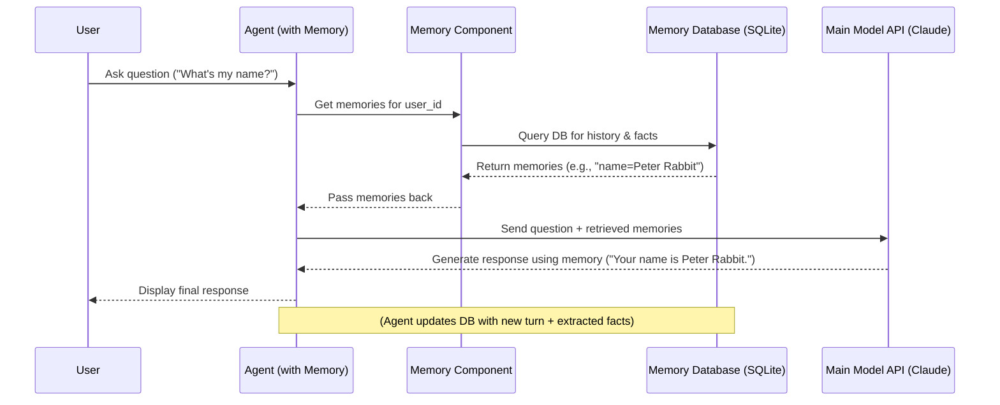

# Chapter 6: Memory

In the [previous chapter](05_knowledge_.html), we learned how **[Knowledge](05_knowledge_.html)** gives our **[Agents](02_agent_.html)** access to specific documents like PDFs or websites, acting like a specialized library. This is great for answering questions based on static information.

But what about conversations? Real conversations flow naturally because people remember what was said just moments ago. If you tell a friend your name, you expect them to remember it later in the conversation, right? Standard [Agents](02_agent_.html), by default, treat every message as a brand new interaction. They don't automatically remember the previous turns of the chat.

This is the problem **Memory** solves. It gives your [Agent](02_agent_.html) the ability to remember past interactions within the _same_ conversation, and potentially even specific facts about a user _across_ different conversations.

## What is Memory?

Think of **Memory** as your [Agent](02_agent_.html)'s short-term recall or a personal notepad. It allows the [Agent](02_agent_.html) to:

1.  **Remember Conversation History:** Keep track of the recent back-and-forth messages between the user and the agent. This allows the agent to understand context like "What did you mean by _that_?" or follow multi-step instructions.
2.  **Store Specific Facts (User Memory):** Remember key details about a user, like their name, preferences (favorite color, city), or past requests. This allows for more personalized and natural interactions over time.

Compared to [Knowledge](05_knowledge_.html), which is about accessing external documents, **Memory** is about retaining information generated _during_ interactions or specifically about the user.

- **[Knowledge](05_knowledge_.html):** The Agent's library of reference books.
- **Memory:** The Agent's notepad for the current conversation and important user details.

## Giving Your Agent Memory

Let's make our [Agent](02_agent_.html) remember things! We'll create an agent that can remember the user's name and favorite food after being told. We'll adapt the `agent_with_memory.py` example.

```python
# File: agents/agent_with_memory.py (Simplified for tutorial)

# 1. Import necessary classes
from agno.agent import Agent
from agno.memory.v2.db.sqlite import SqliteMemoryDb # Where to store memories
from agno.memory.v2.memory import Memory           # The main Memory component
from agno.models.anthropic import Claude           # The Agent's main brain
from agno.models.openai import OpenAIChat          # A model for processing memories

# 2. Define a unique identifier for the user
user_id = "peter_rabbit"

# 3. Configure the Memory component
#    - We need a database to store memories (SqliteMemoryDb is simple)
#    - We need a Model to help process/summarize memories if needed
memory = Memory(
    db=SqliteMemoryDb(table_name="memory", db_file="tmp/memory.db"),
    model=OpenAIChat(id="gpt-4o-mini"), # Model to help manage memory
)
# Optional: Clear previous memories for this user for a fresh start
# memory.clear(user_id=user_id)

# 4. Create the Agent and give it Memory
#    - Assign the user_id so the agent knows who it's talking to
#    - Pass the configured 'memory' object
#    - enable_agentic_memory=True lets the agent decide WHAT to remember
agent = Agent(
    model=Claude(id="claude-3-7-sonnet-latest"), # The main AI engine
    user_id=user_id,                             # Identify the user
    memory=memory,                               # <-- Give the Agent memory!
    enable_agentic_memory=True,                  # <-- Let Agent manage memory
    markdown=True
)

# 5. Interact with the Agent
print(f"--- Interacting with Agent for user: {user_id} ---")

# First interaction: Tell the agent facts
agent.print_response("My name is Peter Rabbit and I like to eat carrots.")

# Second interaction: Ask a question requiring memory
agent.print_response("What is my favorite food?")

# Third interaction: Tell another fact
agent.print_response("My best friend is Jemima Puddleduck.")

# Fourth interaction: Ask a question requiring multiple memories
agent.print_response("Recommend a good lunch meal, who should i invite?")

# Expected Output (Conceptual):
# --- Interacting with Agent for user: peter_rabbit ---
# Okay, I'll remember that your name is Peter Rabbit and you like carrots.
# Your favorite food is carrots.
# Got it, Jemima Puddleduck is your best friend.
# Since you like carrots, perhaps a nice carrot soup or a fresh carrot salad? You could invite your best friend, Jemima Puddleduck!
```

**Explanation:**

1.  **Import:** We import `Agent`, `Claude` (the [Model](01_model_.html)), and also `Memory` and `SqliteMemoryDb` from `agno.memory`. `SqliteMemoryDb` is a simple way to store memory data in a local file (`tmp/memory.db`). We also import `OpenAIChat` which the `Memory` component might use internally for tasks like summarizing history or extracting facts.
2.  **User ID:** We define `user_id = "peter_rabbit"`. This is crucial for distinguishing memories between different users.
3.  **Configure Memory:** We create a `Memory` instance. We tell it _where_ to store the memories using `db=SqliteMemoryDb(...)`. We also give it a [Model](01_model_.html) (`model=OpenAIChat(...)`) that it can use for internal processing tasks related to memory management.
4.  **Create Agent with Memory:** When creating the `Agent`, we pass `user_id=user_id` and `memory=memory`. The key parameter `enable_agentic_memory=True` is important: it allows the underlying [Model](01_model_.html) to analyze the conversation and _proactively decide_ which facts are important to save to the long-term user memory (like "Name is Peter Rabbit", "Likes carrots", "Best friend is Jemima Puddleduck"). Without this, the agent would only remember the raw conversation history for short-term context.
5.  **Interact:**
    - When Peter says his name and favorite food, the agent (because `enable_agentic_memory=True`) understands these are key facts and stores them in the `SqliteMemoryDb` associated with `user_id="peter_rabbit"`.
    - When asked "What is my favorite food?", the agent automatically checks its memory for `peter_rabbit`, finds the fact "Likes carrots", and uses it in the response.
    - The same happens when Peter mentions his best friend.
    - Finally, when asked for a lunch recommendation and who to invite, the agent combines the memory of the favorite food ("carrots") and the best friend ("Jemima Puddleduck") to give a relevant suggestion.

This ability to recall previous parts of the conversation and specific user facts makes the interaction feel much more natural and intelligent.

## Under the Hood: How Memory Works

When an [Agent](02_agent_.html) with `Memory` gets a message:

1.  **You -> Agent:** You send a message (e.g., "What's my name?").
2.  **Agent -> Memory:** The Agent asks its `Memory` component: "Retrieve relevant memories (conversation history and user facts) for `user_id`".
3.  **Memory -> DB:** The `Memory` component queries its database (e.g., `SqliteMemoryDb`) for recent chat messages and stored user facts associated with the `user_id`.
4.  **DB -> Memory:** The database returns the relevant information (e.g., ["User: My name is Peter Rabbit...", "Fact: name=Peter Rabbit"]).
5.  **Memory -> Agent:** The `Memory` component gives the retrieved memories back to the Agent.
6.  **Agent -> Model:** The Agent prepares a prompt for its main [Model](01_model_.html) (e.g., `Claude`). This prompt includes:
    - The user's current message ("What's my name?").
    - The retrieved memories (conversation history, user facts).
    - The Agent's instructions.
7.  **Model -> Agent:** The [Model](01_model_.html) processes the prompt, using the memory context to generate an informed response (e.g., "Your name is Peter Rabbit.").
8.  **Agent -> You:** The Agent sends the final response back to you.
9.  **(Post-Response Memory Update - if `enable_agentic_memory`):**
    - **Agent -> Memory:** The Agent (potentially guided by its [Model](01_model_.html)) analyzes the latest interaction (user message + agent response).
    - **Memory -> Model (Optional):** If `enable_agentic_memory=True`, the Memory component might ask its own helper [Model](01_model_.html) (the `OpenAIChat` we configured) to extract new key facts (e.g., "User mentioned city=London").
    - **Memory -> DB:** The Memory component updates the database with the latest conversation turn and any newly extracted user facts.

Here's a simplified diagram of the retrieval part:



The `Memory` class and its associated database backend (`SqliteMemoryDb`, `PostgresMemoryDb`, etc.) handle the storage, retrieval, and optional intelligent processing (like fact extraction) of memories, making it seamless for the [Agent](02_agent_.html) to hold context-aware conversations.

## Conclusion

You've learned about **Memory**, the crucial component that allows Agno **[Agents](02_agent_.html)** to remember past interactions and user details.

Key Takeaways:

- Memory provides context, enabling more natural and personalized conversations.
- It can store both short-term conversation history and longer-term user facts.
- You add memory to an [Agent](02_agent_.html) using the `memory=` parameter, configured with a database backend (like `SqliteMemoryDb`).
- Using `user_id` ensures memories are kept separate for different users.
- `enable_agentic_memory=True` empowers the agent to intelligently decide what facts to remember about the user.

With a [Model](01_model_.html) (brain), [Tools](03_tools_.html) (actions), [Knowledge](05_knowledge_.html) (library), and now Memory (notepad), our [Agent](02_agent_.html) is becoming quite capable! But where does all this configuration, memory, and knowledge actually get saved persistently? That's where **Storage** comes in. Let's explore that next!

**[Next Chapter: Storage](07_storage_.html)**

---
