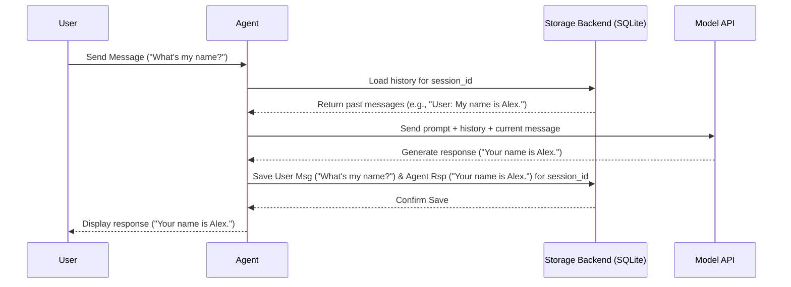

# Chapter 7: Storage

In the [previous chapter](06_memory_.md), we learned about **[Memory](06_memory_.md)**, which gives our **[Agent](02_agent_.md)** a short-term recall, like a notepad, to remember details within a single conversation or specific facts about a user. This is great for making interactions feel more natural and context-aware _during_ a chat session.

But what happens when the conversation ends, or the program stops? By default, everything the agent remembered using its [Memory](06_memory_.md) might be lost. What if you want to chat with your agent today, close the application, and then pick up the _exact same conversation_ tomorrow, with the agent remembering everything that was said before?

This is where **Storage** comes in! It's like saving your work in a document so you can reopen it later.

## What is Storage?

Think of **Storage** as your [Agent](02_agent_.md)'s long-term archive or filing cabinet. While [Memory](06_memory_.md) helps the agent remember things _right now_ (like the last few messages or the user's name), **Storage** saves the _entire_ conversation history – every user message, every agent response, even tool calls – permanently to a file or database.

Imagine writing an essay:

- **[Memory](06_memory_.md):** Remembering the sentence you just wrote or the main point of the current paragraph.
- **Storage:** Clicking "Save" on your Word document, preserving the whole essay so you can close the program and continue writing tomorrow.

Storage provides **persistence**. It allows you to:

- **Resume conversations:** Start a chat, stop, and continue later exactly where you left off.
- **Load past interactions:** Give the agent context from previous conversations.
- **Analyze history:** Review past chats for debugging, performance analysis, or auditing.

Agno supports different storage "backends," like:

- **SQLite:** Saves the history to a simple file on your computer (great for getting started).
- **Postgres:** Saves the history to a powerful database (good for larger applications).

## Using Storage to Save Conversations

Let's create an agent that saves its chat history using SQLite. We'll adapt the `agent_with_storage.py` example.

```python
# File: agents/agent_with_storage.py (Simplified for tutorial)

# 1. Import necessary classes
from agno.agent import Agent
from agno.models.anthropic import Claude
from agno.storage.sqlite import SqliteStorage # <-- Import the Storage backend

# 2. Configure the Storage component
#    - We choose SqliteStorage.
#    - We tell it where to save the database file ('tmp/agents.db').
#    - We give a name to the table inside that file ('agent_sessions').
agent_storage = SqliteStorage(table_name="agent_sessions", db_file="tmp/agents.db")

# 3. Create the Agent and assign the Storage
#    - We pass our configured 'agent_storage' to the 'storage=' parameter.
#    - We set 'add_history_to_messages=True' to tell the agent to USE the history.
#    - We can optionally provide a fixed 'session_id' to always continue the same chat.
chat_agent = Agent(
    model=Claude(id="claude-3-7-sonnet-latest"), # The AI engine
    storage=agent_storage,                     # <-- Assign Storage here!
    # session_id="my_persistent_chat_123",     # Optional: Fix the session ID
    add_history_to_messages=True,              # Load history into prompts
    num_history_runs=3,                        # Load the last 3 turns
    markdown=True
)

# 4. Get the session ID (either fixed or auto-generated)
#    This ID groups all messages for this specific conversation.
session_id = chat_agent.session_id
print(f"Chatting in session: {session_id}")
print("-" * 20)

# 5. Interact with the agent
print("User: Hello! My name is Alex.")
chat_agent.print_response("Hello! My name is Alex.") # This interaction is saved

print("\nUser: What is my name?")
# The agent uses history loaded from storage (via add_history_to_messages)
# to answer this question. The interaction is also saved.
chat_agent.print_response("What is my name?")

# Expected Output (Conceptual):
# Chatting in session: agent_session_which_is_autogenerated_if_not_set # Or your fixed ID
# --------------------
# User: Hello! My name is Alex.
# Assistant: Hello Alex! It's nice to meet you. How can I help you today?
#
# User: What is my name?
# Assistant: Your name is Alex.
```

**Explanation:**

1.  **Import:** We import `Agent`, the [Model](01_model_.md) (`Claude`), and the specific storage backend we want (`SqliteStorage`).
2.  **Configure Storage:** We create an instance of `SqliteStorage`, telling it to save data in a file named `agents.db` inside a `tmp` directory, using a table named `agent_sessions`.
3.  **Create Agent with Storage:** This is the key step! When creating the `Agent`, we pass our `agent_storage` object to the `storage=` parameter.
    - `session_id`: This is crucial. Every message saved to Storage is tagged with this ID. If you create an agent later with the _same_ `session_id`, it will retrieve and continue that specific conversation. If you don't provide one, Agno generates a unique ID automatically.
    - `add_history_to_messages=True`: This tells the agent to actually _load_ the saved history from Storage and include it in the prompt sent to the [Model](01_model_.md). Storage saves the history, but this parameter makes the agent _use_ it for context.
    - `num_history_runs=3`: Limits how many past conversation turns (user message + agent response) are loaded from storage to keep the prompt concise.
4.  **Session ID:** We print the `session_id` being used. If you run this script multiple times _without_ setting a fixed `session_id`, you'll get a new ID each time, starting a new chat. If you _do_ set a fixed `session_id`, running the script again will continue the _same_ chat.
5.  **Interact:** Each time `chat_agent.print_response(...)` is called, the agent not only gets a response but also automatically saves both the user's input and its own output to the `SqliteStorage` database, tagged with the `session_id`. When answering "What is my name?", the agent (because `add_history_to_messages=True`) loads the previous turn ("Hello! My name is Alex.") from storage, allowing it to answer correctly.

If you stopped the script now and ran it again _with the same `session_id`_, the agent would still know your name!

## Retrieving Chat History

Storage isn't just for letting the agent remember; you can also access the saved history yourself.

```python
# File: agents/agent_with_storage.py (Continued)
# ... (agent created as above with storage) ...

# Run some interactions first if you haven't already
# chat_agent.print_response("Hello! My name is Alex.")
# chat_agent.print_response("What is my name?")

# Now, retrieve all messages saved for this agent's session
all_messages = chat_agent.get_messages_for_session()

print("\n--- Full Chat History from Storage ---")
from rich.pretty import pprint
pprint(all_messages) # Pretty-print the list of messages

# Expected Output (Conceptual - a list of message dictionaries):
# --- Full Chat History from Storage ---
# [
#     {'role': 'user', 'content': 'Hello! My name is Alex.', ...},
#     {'role': 'assistant', 'content': "Hello Alex! It's nice to meet you...", ...},
#     {'role': 'user', 'content': 'What is my name?', ...},
#     {'role': 'assistant', 'content': 'Your name is Alex.', ...}
# ]
```

**Explanation:**

The `agent.get_messages_for_session()` method connects to the configured `Storage` (our SQLite file) and fetches all message records associated with the agent's current `session_id`. This gives you a complete log of the conversation, which is useful for debugging, analysis, or displaying chat history in an application.

## Under the Hood: How Storage Works

When an [Agent](02_agent_.md) interacts and uses Storage:

1.  **User -> Agent:** You send a message (e.g., "What's the capital of France?").
2.  **Agent -> Storage (Load History):** If `add_history_to_messages` is enabled, the Agent asks the `Storage` component (e.g., `SqliteStorage`) to retrieve the last `num_history_runs` messages for the current `session_id`.
3.  **Storage -> DB (Query):** The Storage component queries its backend (the SQLite file) for the relevant message records.
4.  **DB -> Storage:** The database returns the historical messages.
5.  **Storage -> Agent:** The Storage component sends the retrieved history back to the Agent.
6.  **Agent -> Model:** The Agent prepares a prompt for its [Model](01_model_.md), including the user's current message and the retrieved history.
7.  **Model -> Agent:** The [Model](01_model_.md) generates a response (e.g., "The capital of France is Paris.").
8.  **Agent -> Storage (Save Interaction):** The Agent tells the `Storage` component to save both the user's message and its own response (and any tool calls if they happened) associated with the current `session_id`.
9.  **Storage -> DB (Insert):** The Storage component inserts the new message records into its backend (the SQLite file).
10. **DB -> Storage:** The database confirms the save operation.
11. **Storage -> Agent:** Confirmation is passed back (usually implicitly).
12. **Agent -> User:** The Agent displays the response.

Here’s a simplified diagram:



Agno's `Storage` classes handle the details of connecting to the database (SQLite, Postgres, etc.), formatting the data, and performing the save (`save_message`) and retrieve (`get_messages`) operations based on the `session_id`.

## Conclusion

You've learned about **Storage**, the mechanism in Agno for achieving long-term persistence of conversations.

Key Takeaways:

- Storage saves the entire interaction history (user messages, agent responses, tool calls).
- It allows conversations to be resumed across different sessions or application restarts.
- You configure it using the `storage=` parameter when creating an [Agent](02_agent_.md), choosing a backend like `SqliteStorage` or `PostgresStorage`.
- The `session_id` is the key identifier that links messages to a specific conversation.
- Parameters like `add_history_to_messages` control how the saved history is used for context by the agent.
- You can retrieve the full history using `agent.get_messages_for_session()`.

So far, we've focused mainly on individual [Agents](02_agent_.md). But what if you need multiple specialized agents to collaborate on a complex task? That's where a **Team** comes in, and we'll explore how to build and manage them next!

**[Next Chapter: Team](08_team_.md)**

---

Generated by [AI Codebase Knowledge Builder](https://github.com/The-Pocket/Tutorial-Codebase-Knowledge)
