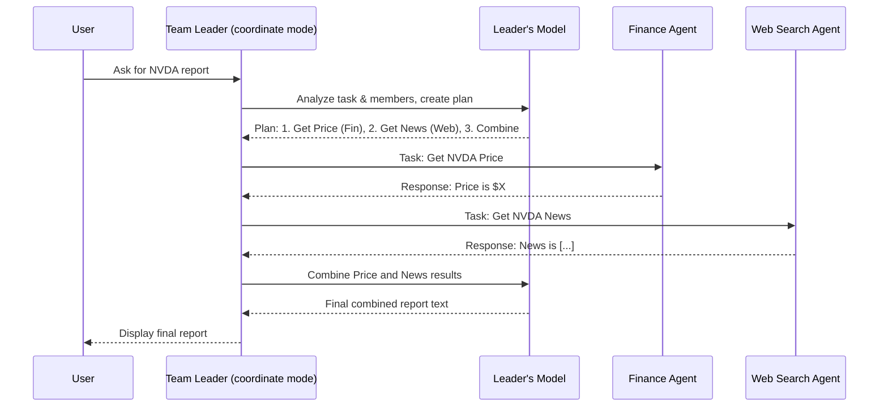
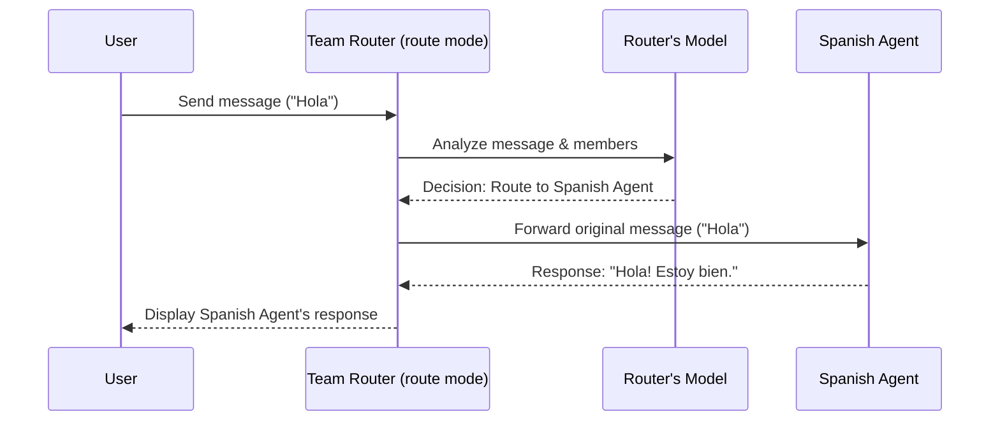

# Chapter 8: Team

Welcome back! In the [previous chapter](07_storage_.md), we learned about **[Storage](07_storage_.md)**, which allows our **[Agents](02_agent_.md)** to save and recall entire conversations, providing long-term persistence. We've built up quite a capable solo [Agent](02_agent_.md) with a [Model](01_model_.md) (brain), [Tools](03_tools_.md) (actions), [Knowledge](05_knowledge_.md) (library), [Memory](06_memory_.md) (notepad), and [Storage](07_storage_.md) (filing cabinet).

But what if a task is too complex or requires too many different skills for a single [Agent](02_agent_.md)? Imagine you need a detailed financial report on a company. This might require:

1.  Searching the web for recent news.
2.  Using financial tools to get stock prices and company data.
3.  Analyzing all this information and writing a structured report.

One super-agent _might_ be able to do this, but it's often better to have specialists work together. Just like in a real company, you might have a researcher, a financial analyst, and a writer collaborate.

This is where the **Team** concept in Agno comes in!

## What is a Team?

Think of a **Team** as a way to manage a group of specialized **[Agents](02_agent_.md)**, allowing them to work together on a common goal. It's like being the manager of a project team.

- You have **members**, which are just the [Agents](02_agent_.md) we've already learned about, each potentially having its own role, [Model](01_model_.md), [Tools](03_tools_.md), and [Knowledge](05_knowledge_.md).
- The **Team** itself acts as a coordinator or leader, orchestrating the work among its members.
- The Team decides how the members interact based on its configured **mode**.

## Why Use Teams?

Teams are powerful because they allow you to:

- **Combine Diverse Skills:** Bring together agents with different tools and expertise (e.g., a web searcher and a financial analyst).
- **Break Down Complexity:** Divide large tasks into smaller sub-tasks handled by specialized agents.
- **Improve Reliability:** If one agent struggles, another might be able to help or take over.
- **Organize Your Code:** Structure complex AI workflows logically using different agent roles.

## Team Modes: Different Ways to Work Together

A Team can operate in different modes, controlling how the member [Agents](02_agent_.md) interact:

1.  **`coordinate` mode:**

    - **Analogy:** A project manager assigning tasks.
    - **How it works:** The Team acts like a leader or manager. It receives the main task, decides which member [Agent](02_agent_.md) is best suited for each sub-task, delegates the work, gathers the results, and compiles the final answer. The leader might even use its own [Tools](03_tools_.md), like [Reasoning / Thinking Tools](04_reasoning___thinking_tools_.md), to plan the work.
    - **Use case:** Tasks requiring a structured workflow with distinct steps (e.g., research -> analyze -> write).

2.  **`collaborate` mode:**

    - **Analogy:** A brainstorming session or roundtable discussion.
    - **How it works:** Member [Agents](02_agent_.md) discuss the task amongst themselves, share ideas, and build upon each other's contributions until a consensus or final result is reached. The Team facilitates this discussion.
    - **Use case:** Complex problem-solving, creative tasks, debates, scenarios where multiple perspectives are valuable (e.g., `discussion_team.py`).

3.  **`route` mode:**
    - **Analogy:** A dispatcher or receptionist directing calls.
    - **How it works:** The Team acts as a smart router. It receives the user's request, analyzes it, and directs it to the _single_ most appropriate member [Agent](02_agent_.md) to handle the entire task.
    - **Use case:** Customer support classifying inquiries, multi-language bots routing to the correct language agent (e.g., `multi_language_team.py`).

Let's see how to build a team!

## Creating a Team (`coordinate` mode)

Let's build a simple team to handle our financial report use case. We need two specialized agents: one for web search and one for financial data. We'll use `coordinate` mode, where a team leader directs them. We'll adapt the `agent_team.py` example.

```python
# File: agents/agent_team.py (Simplified for tutorial)

# 1. Import necessary classes
from agno.agent import Agent
from agno.team.team import Team
from agno.models.openai import OpenAIChat  # Using OpenAI models
from agno.tools.duckduckgo import DuckDuckGoTools # Web search tool
from agno.tools.yfinance import YFinanceTools   # Finance tool

# 2. Define the Member Agents
#    These are just regular Agents we learned about before!
web_agent = Agent(
    name="Web Search Agent",
    role="Handle web search requests",
    model=OpenAIChat(id="gpt-4o-mini"), # Specific brain
    tools=[DuckDuckGoTools()],           # Specific tool
    instructions="Always include sources.",
)

finance_agent = Agent(
    name="Finance Agent",
    role="Handle financial data requests",
    model=OpenAIChat(id="gpt-4o-mini"),
    tools=[YFinanceTools(stock_price=True)], # Can get stock prices
    instructions="Use tables to display data.",
)

# 3. Create the Team
#    - 'mode="coordinate"': The team leader will delegate tasks.
#    - 'model=...': The brain for the team leader itself.
#    - 'members=[...]': The list of agents in the team.
report_team = Team(
    name="Financial Report Team Leader",
    mode="coordinate",                      # <-- Manager mode!
    model=OpenAIChat(id="gpt-4o"),          # <-- Leader's brain
    members=[web_agent, finance_agent],     # <-- The team members
    instructions=[                          # <-- Leader's instructions
        "Coordinate the web and finance agents to create a report.",
        "First, get the stock price, then find recent news.",
        "Combine the results into a final summary.",
    ],
    markdown=True,
    show_members_responses=True, # Useful for seeing member contributions
)

# 4. Give the Team a Task
task = "Give me the stock price and recent news for NVIDIA (NVDA)."
print(f"--- Asking the team to: {task} ---")
report_team.print_response(task, stream=True)

# Expected Output (Conceptual):
# --- Asking the team to: Give me the stock price and recent news for NVIDIA (NVDA). ---
#
# Team Leader (Thinking): Okay, I need the stock price and news for NVDA.
# Team Leader -> Finance Agent: What is the stock price of NVDA?
# Finance Agent (Output):
# | Ticker | Price | Currency |
# | :----- | :---- | :------- |
# | NVDA   | ...   | USD      |
#
# Team Leader (Thinking): Got the price. Now for the news.
# Team Leader -> Web Search Agent: Find recent news about NVDA.
# Web Search Agent (Output):
# Recent news about NVDA includes articles about ... [links/sources]...
#
# Team Leader (Compiling): Okay, combining the info...
#
# Final Output to User:
# NVIDIA (NVDA) stock price is $... USD.
# Recent news includes articles about ... [links/sources]...
```

**Explanation:**

1.  **Import:** We import `Agent`, `Team`, the [Model](01_model_.md) (`OpenAIChat`), and the necessary [Tools](03_tools_.md) (`DuckDuckGoTools`, `YFinanceTools`).
2.  **Define Members:** We create two standard [Agents](02_agent_.md): `web_agent` with web search tools and `finance_agent` with financial tools. Each has its own simple instructions.
3.  **Create Team:**
    - We instantiate `Team`.
    - `name` gives the team leader a name.
    - `mode="coordinate"` sets the operational style.
    - `model=OpenAIChat(...)` specifies the AI model the _team leader_ uses to understand the task, plan, delegate, and synthesize results.
    - `members=[web_agent, finance_agent]` lists the agents available to the leader.
    - `instructions` guide the _team leader_ on how to approach the task and manage the members.
    - `show_members_responses=True` makes the output more verbose, showing what each member agent said (useful for debugging!).
4.  **Run Task:** We call `report_team.print_response()` with our request. The team leader ([Model](01_model_.md)) receives this, follows its instructions, delegates sub-tasks to `finance_agent` and `web_agent` sequentially, gets their responses back, and finally combines them into the final output printed to the console.

## A Quick Look at `route` Mode

Let's briefly see how a `route` mode team works, using the `multi_language_team.py` example conceptually. Imagine agents specialized in different languages.

```python
# File: teams/route/multi_language_team.py (Conceptual)
# ... imports ...

# Define Agents for different languages
english_agent = Agent(name="English Agent", role="Answer in English", ...)
spanish_agent = Agent(name="Spanish Agent", role="Answer in Spanish", ...)
french_agent = Agent(name="French Agent", role="Answer in French", ...)

# Create the Router Team
language_router = Team(
    name="Language Router",
    mode="route", # <-- Dispatcher mode!
    model=OpenAIChat("gpt-4o"), # Model for the router to decide language
    members=[english_agent, spanish_agent, french_agent],
    instructions=[
        "Identify the language of the user's question.",
        "Forward the question ONLY to the agent matching that language.",
        "If no matching agent, say you don't support the language."
    ],
    # ... other parameters ...
)

# Ask a question in Spanish
language_router.print_response("Hola, ¿cómo estás?")
# Expected: Router identifies Spanish, sends task to spanish_agent,
#           spanish_agent replies "Hola! Estoy bien, ¿y tú?". Router relays this.

# Ask a question in Italian (not supported)
language_router.print_response("Come stai?")
# Expected: Router identifies Italian, sees no Italian agent, replies
#           "I don't support Italian. Please use English, Spanish, or French."
```

In `route` mode, the Team's main job is just to pick the _one_ best member for the task and pass the request along.

## Under the Hood: How Teams Coordinate

What happens internally when you give a task to a Team?

**`coordinate` Mode Flow:**

1.  **You -> Team Leader:** You give the main task (e.g., `report_team.print_response("Report on NVDA")`).
2.  **Team Leader -> Leader's Model:** The leader (using its assigned [Model](01_model_.md), e.g., GPT-4o) analyzes the task, its own instructions, and the available `members` (Web Agent, Finance Agent). It might create a plan (possibly using [Reasoning / Thinking Tools](04_reasoning___thinking_tools_.md) if provided).
3.  **Leader's Model -> Team Leader:** The model decides the first step, e.g., "Ask Finance Agent for stock price."
4.  **Team Leader -> Member Agent (e.g., Finance Agent):** The leader sends the sub-task ("What is stock price of NVDA?") to the chosen member.
5.  **Member Agent -> Member's Model/Tool:** The member agent executes the sub-task (using its own [Model](01_model_.md) and [Tools](03_tools_.md), e.g., `YFinanceTools`).
6.  **Member Agent -> Team Leader:** The member sends its result back to the leader.
7.  **Team Leader -> Leader's Model:** The leader takes the result, checks its plan, and decides the next step (e.g., "Ask Web Agent for news.").
8.  **(Repeat steps 3-7 for other sub-tasks)**
9.  **Team Leader -> Leader's Model:** Once all sub-tasks are done, the leader sends all collected results to its [Model](01_model_.md) asking it to synthesize the final answer based on the original request.
10. **Leader's Model -> Team Leader:** The model generates the final, combined response.
11. **Team Leader -> You:** The leader presents the final answer.



**`route` Mode Flow:**

1.  **You -> Team Router:** You send a request (e.g., `language_router.print_response("Hola")`).
2.  **Team Router -> Router's Model:** The router (using its [Model](01_model_.md)) analyzes the request, its instructions, and the available `members` (English, Spanish, French Agents) to determine the best fit.
3.  **Router's Model -> Team Router:** The model decides, e.g., "This is Spanish, route to Spanish Agent."
4.  **Team Router -> Member Agent (e.g., Spanish Agent):** The router forwards the _original_ user request to the chosen member.
5.  **Member Agent -> Member's Model/Tool:** The member agent handles the request using its own capabilities.
6.  **Member Agent -> Team Router:** The member sends its final response back to the router.
7.  **Team Router -> You:** The router relays the member's response directly to you.



Agno's `Team` class manages these complex interactions based on the chosen `mode`, making it easy to build sophisticated multi-agent systems.

## Conclusion

You've now learned about **Teams** in Agno, a powerful way to orchestrate multiple specialized **[Agents](02_agent_.md)**.

Key Takeaways:

- Teams allow multiple Agents to work together on complex tasks.
- Member agents are just regular [Agents](02_agent_.md) with specific roles, tools, or knowledge.
- Teams operate in different **modes**:
  - `coordinate`: Leader delegates tasks (like a manager).
  - `collaborate`: Members discuss and work together (like brainstorming).
  - `route`: Router directs task to the best member (like a dispatcher).
- You create a Team by specifying its `mode`, `members`, `model` (for the leader/router), and `instructions`.
- Teams enable building more capable, organized, and robust AI applications.

We've covered the core building blocks of Agno: [Model](01_model_.md), [Agent](02_agent_.md), [Tools](03_tools_.md), [Reasoning / Thinking Tools](04_reasoning___thinking_tools_.md), [Knowledge](05_knowledge_.md), [Memory](06_memory_.md), [Storage](07_storage_.md), and now [Team](08_team_.md). How can we put these together to create an interactive web application? Let's find out in the final chapter!

**[Next Chapter: Streamlit Application](09_streamlit_application_.md)**

---

Generated by [AI Codebase Knowledge Builder](https://github.com/The-Pocket/Tutorial-Codebase-Knowledge)
