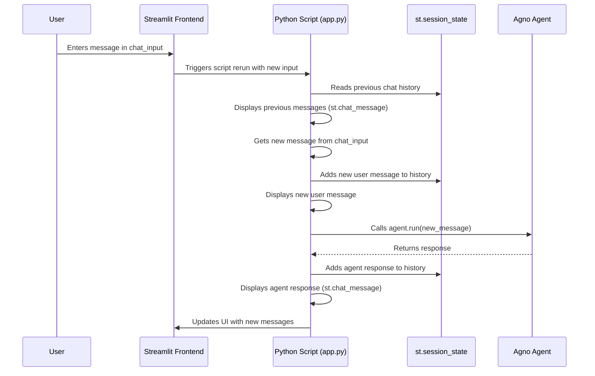

# Chapter 9: Streamlit Application

Welcome to the final chapter of our core concepts tutorial! In the [previous chapter](08_team_.md), we saw how to assemble a **[Team](08_team_.md)** of specialized **[Agents](02_agent_.md)** to tackle complex tasks collaboratively. We've built powerful AI assistants and teams, but so far, we've mostly interacted with them by running Python scripts in the terminal.

That's great for development, but what if you want to share your creation with others who aren't programmers? What if you want a user-friendly way to chat with your agent, upload files, or see results visually?

This is where **Streamlit** comes in! It's a fantastic tool often used in the `apps/` directory of the Agno examples to create simple, interactive web interfaces for your AI applications.

## What is a Streamlit Application?

Imagine you've built an amazing Agno [Agent](02_agent_.md) that can answer questions about Formula 1 racing, using its [Knowledge](05_knowledge_.md) of a database and its [Tools](03_tools_.md) to fetch live results. You want your friend, who loves F1 but doesn't code, to be able to use it. Asking them to run Python code isn't ideal.

Instead, you can build a **Streamlit Application**. Think of Streamlit as a super-fast way to build a web page *using only Python*. You don't need to learn complex web technologies like HTML, CSS, or JavaScript.

With Streamlit, you can easily create:

*   Chat windows to talk to your [Agent](02_agent_.md) or [Team](08_team_.md).
*   Buttons to trigger actions.
*   File uploaders to provide documents to your [Knowledge](05_knowledge_.md) base.
*   Dropdown menus to select different [Models](01_model_.md) or options.
*   Ways to display results, tables, and even charts.

Essentially, Streamlit lets you wrap your Agno logic (Agents, Teams, etc.) in a simple, interactive graphical user interface (GUI) that runs in a web browser.

## Why Use Streamlit with Agno?

*   **Ease of Use:** Build interactive web apps quickly with just Python.
*   **Rapid Prototyping:** Quickly create a front-end to test and showcase your Agno agents/teams.
*   **User-Friendly Interaction:** Allows non-programmers to easily interact with your AI applications (chat, upload files, select options).
*   **Integration:** Works seamlessly with Python libraries like Agno.

Many examples in the `apps/` directory (like `apps/answer_engine/`, `apps/agentic_rag/`, `apps/sql_agent/`) use Streamlit to provide these web interfaces.

## A Simple Streamlit Chat Interface (Conceptual)

Let's look at the basic structure of how a Streamlit application might interact with an Agno [Agent](02_agent_.md) to create a chat interface. We'll simplify the code found in examples like `apps/answer_engine/app.py`.

```python
# File: conceptual example based on apps/answer_engine/app.py

# 1. Import Streamlit and Agno components
import streamlit as st
from agents import get_sage # Function to get our pre-configured Agno Agent

# 2. Set up the page title
st.title("My Awesome AI Assistant")

# 3. Initialize the Agent (or get it from Streamlit's session state)
#    'st.session_state' is Streamlit's way to remember things between interactions.
if "my_agent" not in st.session_state:
    st.session_state.my_agent = get_sage(model_id="...") # Load your agent
agent = st.session_state.my_agent

# 4. Initialize chat history in session state
if "messages" not in st.session_state:
    st.session_state.messages = []

# 5. Display past messages
for message in st.session_state.messages:
    with st.chat_message(message["role"]): # Display as 'user' or 'assistant'
        st.markdown(message["content"])

# 6. Get new user input
if prompt := st.chat_input("Ask the assistant anything!"):
    # Add user message to history and display it
    st.session_state.messages.append({"role": "user", "content": prompt})
    with st.chat_message("user"):
        st.markdown(prompt)

    # 7. Get response from the Agno Agent
    with st.chat_message("assistant"):
        with st.spinner("Thinking..."): # Show a loading spinner
            # This is where Agno does its magic!
            response = agent.run(prompt, stream=False) # Or stream=True
            response_content = response.content

            # Display assistant's response
            st.markdown(response_content)
            # Add assistant response to history
            st.session_state.messages.append({"role": "assistant", "content": response_content})

```

**Explanation:**

1.  **Import:** We import `streamlit` (usually as `st`) and the necessary Agno components, including a function to get our configured [Agent](02_agent_.md).
2.  **Title:** `st.title()` sets the main title displayed on the web page.
3.  **Agent Initialization:** We use `st.session_state` to store our Agno `agent`. This is crucial because Streamlit reruns the script on every interaction; `session_state` lets us keep the same agent instance loaded instead of creating a new one every time.
4.  **Chat History:** We also use `st.session_state` to store the list of chat messages.
5.  **Display History:** We loop through the saved messages and use `st.chat_message()` to display them with the correct role (user or assistant).
6.  **User Input:** `st.chat_input()` creates the text box at the bottom of the screen for the user to type their message. When the user presses Enter, the entered text is stored in the `prompt` variable.
7.  **Agent Response:**
    *   We display the user's `prompt` immediately.
    *   We then call our Agno `agent.run(prompt)` to get the AI's response.
    *   We display the response using `st.chat_message("assistant")` and `st.markdown()`.
    *   Finally, we save the assistant's response to the `st.session_state.messages` history.

When you run this Python file using `streamlit run your_app_file.py`, Streamlit starts a web server and opens a browser tab showing this interactive chat interface!

## Key Streamlit Concepts Used in Agno Apps

Looking at the example applications in `apps/`, you'll often see these Streamlit elements:

*   **`st.title()`, `st.header()`, `st.markdown()`:** For adding text and headings.
*   **`st.sidebar`:** Creates a collapsible sidebar area, often used for settings, model selection (`st.selectbox`), or buttons (`st.button`).
*   **`st.chat_input()`:** The primary way to get text input in a chat interface.
*   **`st.chat_message()`:** Displays messages in a chat bubble format, differentiating between 'user' and 'assistant'.
*   **`st.session_state`:** A dictionary-like object to store variables that need to persist across user interactions (reruns). Essential for storing chat history, the loaded Agent/Team instance, user settings, etc.
*   **`st.spinner()`:** Shows a temporary "loading" message while the agent is processing.
*   **`st.write_stream()`:** Used with Agno's streaming responses (`agent.run(..., stream=True)`) to display the output word-by-word as it's generated.
*   **`st.file_uploader()`:** Allows users to upload files (e.g., PDFs for [Knowledge](05_knowledge_.md) in `apps/agentic_rag/app.py`).
*   **`st.button()`, `st.checkbox()`, `st.selectbox()`, `st.radio()`:** Various input widgets for user interaction.
*   **`st.rerun()`:** Forces Streamlit to rerun the script immediately, often used after updating `session_state`.

## Under the Hood: The Streamlit Execution Model

It's helpful to understand how Streamlit works:

1.  **Run Script:** When you start the app (`streamlit run app.py`) or interact with a widget (click a button, enter text), Streamlit **reruns your entire Python script from top to bottom**.
2.  **State Management:** Because the script reruns, normal Python variables are lost. `st.session_state` is the **only** way to maintain information (like who the user is, the chat history, or the loaded Agno Agent) between these reruns.
3.  **UI Rendering:** As Streamlit runs your script, it encounters `st.` commands (like `st.title`, `st.button`, `st.chat_message`) and renders the corresponding UI elements in the browser.
4.  **Input Handling:** When a user interacts (e.g., types in `st.chat_input` and hits Enter), Streamlit captures that input, stores it, and triggers another rerun of the script. In the new run, the value from the input widget (like `st.chat_input`) will be available in your code.

Here's a diagram showing the basic loop:



The key takeaway is that your Agno Agent/Team is typically loaded once and stored in `st.session_state`, and the chat history is also managed there, allowing the application to feel stateful despite the script rerunning constantly.

## Conclusion

You've now learned about **Streamlit Applications**, the common way Agno examples provide user-friendly web interfaces for interacting with [Agents](02_agent_.md) and [Teams](08_team_.md).

Key Takeaways:

*   Streamlit allows you to build interactive web apps for your AI using only Python.
*   It's great for creating chat interfaces, dashboards, and tools for non-programmers to use Agno applications.
*   Core components include UI elements (`st.title`, `st.chat_input`, `st.chat_message`) and state management (`st.session_state`).
*   The `apps/` directory in the `agno` examples contains many practical Streamlit applications showcasing different Agno features.

This concludes our tour of the fundamental concepts in the Agno examples project! We've covered the journey from the core [Model](01_model_.md) brain, through specialized [Agents](02_agent_.md) equipped with [Tools](03_tools_.md) and [Knowledge](05_knowledge_.md), remembering with [Memory](06_memory_.md), saving with [Storage](07_storage_.md), collaborating in [Teams](08_team_.md), and finally, presenting it all through an interactive [Streamlit Application](09_streamlit_application_.md).

With these building blocks, you're now well-equipped to explore the examples, understand how they work, and start building your own sophisticated AI applications with Agno! Happy coding!

---

Generated by [AI Codebase Knowledge Builder](https://github.com/The-Pocket/Tutorial-Codebase-Knowledge)