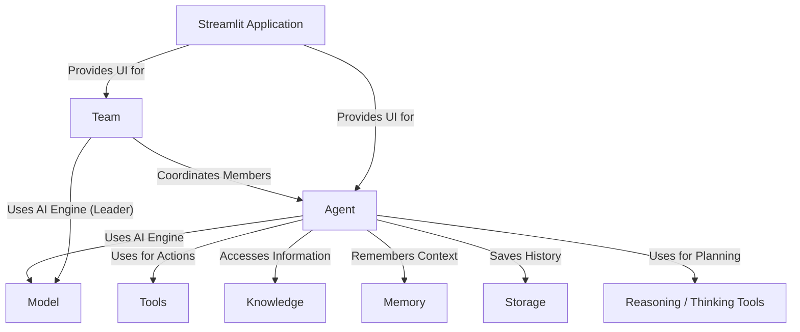

# Agno Cookbook Examples Tutorial

Agno helps you build AI assistants called **Agents**. Think of an _Agent_ as a specialized worker that uses an AI **Model** (like GPT-4o) as its brain.
You can give _Agents_ **Tools** (like web search or calculators) to perform actions, **Knowledge** (like documents) to reference information, **Memory** to remember conversations, and **Storage** to save chats.
**Reasoning Tools** help _Agents_ think step-by-step.
Multiple _Agents_ can work together in a **Team**, coordinated by a leader or collaborating freely.
Finally, you can build interactive web interfaces using **Streamlit Applications** to chat with your _Agents_ and _Teams_.

**Source Repository:** [https://github.com/agno-agi/agno/tree/main/cookbook/examples](https://github.com/agno-agi/agno/tree/main/cookbook/examples)

## Chapters

1. [Model
   ](01_model_.md)
2. [Agent
   ](02_agent_.md)
3. [Tools
   ](03_tools_.md)
4. [Reasoning / Thinking Tools
   ](04_reasoning___thinking_tools_.md)
5. [Knowledge
   ](05_knowledge_.md)
6. [Memory
   ](06_memory_.md)
7. [Storage
   ](07_storage_.md)
8. [Team
   ](08_team_.md)
9. [Streamlit Application
   ](09_streamlit_application_.md)

---

Generated by [AI Codebase Knowledge Builder](https://github.com/The-Pocket/Tutorial-Codebase-Knowledge)
