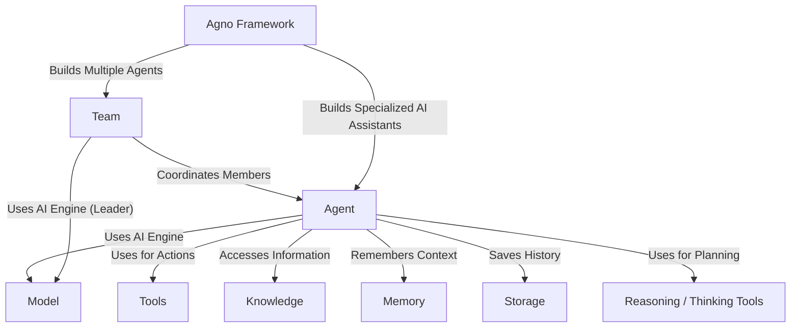

# Agno Cookbook Examples Tutorial

Agno helps you build AI assistants called **Agents**. Think of an _Agent_ as a specialized worker that uses an AI **Model** (like GPT-4o) as its brain.

_Agents_ can be enhanced with:

- **Tools**: (like web search or calculators) to perform actions.
- **Knowledge**: (like documents) to reference information.
- **Memory**: To remember conversations.
- **Storage**: To save chats.
- **Reasoning Tools**: To help _Agents_ think step-by-step.

Multiple _Agents_ can work together in a **Team**, coordinated by a leader or collaborating freely.

Finally, you can build interactive web interfaces using **Streamlit Applications** to chat with your _Agents_ and _Teams_.

**Source Repository:** [https://github.com/agno-agi/agno/tree/main/cookbook/examples](https://github.com/agno-agi/agno/tree/main/cookbook/examples)

## Chapters

1. [Model
   ](01_model_.html)
2. [Agent
   ](02_agent_.html)
3. [Tools
   ](03_tools_.html)
4. [Reasoning / Thinking Tools
   ](04_reasoning___thinking_tools_.html)
5. [Knowledge
   ](05_knowledge_.html)
6. [Memory
   ](06_memory_.html)
7. [Storage
   ](07_storage_.html)
8. [Team
   ](08_team_.html)
9. [Streamlit Application
   ](09_streamlit_application_.html)

---
